# BPMspace Claude Global Skills Library

This repository contains a collection of **skills** and **commands** designed for use with Claude Code CLI, upgraded to **Skills 2.0** with frontmatter-driven configuration. These resources are installed globally on your development machine and reused across multiple projects.

## Contents

- `my/` -- all custom `c-bpm-`prefixed items (skills, commands, runbooks), versioned and synced across machines
- `runbooks/` -- detailed operational guides for recurring processes
- `templates/` -- issue and pull-request templates

### my/ Directory

All custom items follow the `c-bpm-{type}-{name}` naming convention and live under `my/`:

| Type | Path | Format |
|------|------|--------|
| Skills | `my/skills/c-bpm-sk-<name>/` | Directory with `SKILL.md` |
| Commands | `my/commands/c-bpm-cm-<name>.md` | Flat .md file |
| Runbooks | `my/runbooks/c-bpm-rb-<name>.md` | Flat .md file |

## Dependency Graph

Relationships between all skills and commands in this library. Arrows show explicit references (one item names another in its content).

```mermaid
flowchart LR
    %% --- Node definitions ---

    %% Foundational
    subgraph foundational["Foundational Patterns"]
        api-contract([api-contract])
        bash-secure-script([bash-secure-script])
        config-secrets([config-secrets])
        repo-scaffold([repo-scaffold])
        test-harness([test-harness])
        curlbash-installer([curlbash-installer])
        release-ops([release-ops])
    end

    %% PHP / Web
    subgraph phpweb["PHP / Web"]
        flightphp-pro([flightphp-pro])
        php-crud-api-review([php-crud-api-review])
    end

    %% Data / Infra
    subgraph datainfra["Data / Infra"]
        mariadb-migrations([mariadb-migrations])
        redis-keyspace([redis-keyspace])
        n8n-reliability([n8n-reliability])
    end

    %% Security
    subgraph security["Security"]
        appsec-threatlite([appsec-threatlite])
        tls-http-headers([tls-http-headers])
    end

    %% Interactive
    subgraph interactive["Interactive"]
        grill-me([grill-me])
        grill-me-issue([grill-me-issue])
        grill-claude-issue([grill-claude-issue])
        idea-merge([idea-merge])
    end

    %% Ops / Team
    subgraph opsteam["Ops / Team"]
        auditor([auditor])
        linux-admin([linux-admin])
        linux-archive([linux-archive])
        linux-audit([linux-audit])
        milestone-type([milestone-type])
    end

    %% Meta
    subgraph meta["Meta"]
        skill-creator([skill-creator])
        skill-optimizer([skill-optimizer])
        library-manager([library-manager])
        llm-selection([llm-selection])
    end

    %% Commands
    subgraph commands["Commands"]
        cm-library-pull{{library-pull}}
        cm-library-push{{library-push}}
        cm-library-compare{{library-compare}}
        cm-openissues-list{{openissues-list}}
        cm-openissues-team{{openissues-team}}
        cm-refactor-repo{{refactor-repo}}
        cm-skill-creator{{skill-creator cmd}}
        cm-skill-optimizer{{skill-optimizer cmd}}
    end

    %% --- Skill-to-Skill edges ---
    appsec-threatlite -->|"references"| tls-http-headers
    linux-audit -->|"creates findings for"| linux-admin
    linux-archive -->|"shares host pattern"| linux-audit
    linux-archive -->|"shares host pattern"| linux-admin
    skill-creator -->|"delegates to"| skill-optimizer
    grill-me -->|"hands off to"| grill-me-issue
    grill-claude-issue -->|"differentiates from"| grill-me
    grill-claude-issue -->|"differentiates from"| grill-me-issue
    auditor -->|"loads"| appsec-threatlite
    auditor -->|"loads"| test-harness
    library-manager -->|"references"| skill-creator
    library-manager -->|"references"| skill-optimizer
    flightphp-pro -->|"references"| milestone-type
    skill-creator -->|"push workflow"| library-manager
    skill-optimizer -->|"push workflow"| library-manager

    %% --- Skill-to-Command edges ---
    library-manager -->|"documents"| cm-library-pull
    library-manager -->|"documents"| cm-library-push
    skill-creator -->|"recommends"| cm-library-push
    skill-optimizer -->|"recommends"| cm-library-push

    %% --- Command-to-Skill edges ---
    cm-openissues-team -->|"routes tasks to"| appsec-threatlite
    cm-openissues-team -->|"routes tasks to"| tls-http-headers
    cm-openissues-team -->|"routes tasks to"| config-secrets
    cm-openissues-team -->|"routes tasks to"| bash-secure-script
    cm-openissues-team -->|"routes tasks to"| curlbash-installer
    cm-openissues-team -->|"routes tasks to"| test-harness
    cm-openissues-team -->|"routes tasks to"| api-contract
    cm-openissues-team -->|"routes tasks to"| php-crud-api-review
    cm-openissues-team -->|"routes tasks to"| flightphp-pro
    cm-openissues-team -->|"routes tasks to"| redis-keyspace
    cm-openissues-team -->|"routes tasks to"| mariadb-migrations
    cm-openissues-team -->|"routes tasks to"| release-ops
    cm-openissues-team -->|"routes tasks to"| repo-scaffold
    cm-openissues-team -->|"routes tasks to"| n8n-reliability
    cm-skill-creator -->|"delegates to"| cm-skill-optimizer
    cm-skill-creator -->|"recommends"| cm-library-push
    cm-skill-creator -->|"references"| library-manager
    cm-skill-optimizer -->|"recommends"| cm-library-push
    cm-skill-optimizer -->|"references"| library-manager

    %% --- Command-to-Command edges ---
    cm-library-compare -->|"triggers"| cm-library-pull
    cm-library-compare -->|"triggers"| cm-library-push

    %% --- Styles ---
    classDef skillNode fill:#e8f4fd,stroke:#2196F3,color:#1565C0
    classDef cmdNode fill:#fff9c4,stroke:#f9a825,color:#f57f17
    classDef foundGroup fill:#e3f2fd,stroke:#1976D2
    classDef phpGroup fill:#e8f5e9,stroke:#388E3C
    classDef dataGroup fill:#fff3e0,stroke:#F57C00
    classDef secGroup fill:#ffebee,stroke:#D32F2F
    classDef intGroup fill:#f3e5f5,stroke:#7B1FA2
    classDef opsGroup fill:#e0f2f1,stroke:#00796B
    classDef metaGroup fill:#f5f5f5,stroke:#616161
    classDef cmdGroup fill:#fffde7,stroke:#F9A825

    class api-contract,bash-secure-script,config-secrets,repo-scaffold,test-harness,curlbash-installer,release-ops,flightphp-pro,php-crud-api-review,mariadb-migrations,redis-keyspace,n8n-reliability,appsec-threatlite,tls-http-headers,grill-me,grill-me-issue,grill-claude-issue,idea-merge,auditor,linux-admin,linux-archive,linux-audit,milestone-type,skill-creator,skill-optimizer,library-manager,llm-selection skillNode
    class cm-library-pull,cm-library-push,cm-library-compare,cm-openissues-list,cm-openissues-team,cm-refactor-repo,cm-skill-creator,cm-skill-optimizer cmdNode
    class foundational foundGroup
    class phpweb phpGroup
    class datainfra dataGroup
    class security secGroup
    class interactive intGroup
    class opsteam opsGroup
    class meta metaGroup
    class commands cmdGroup
```



## Item Inventory

### Skills (27)

| Name | Group | Description | User-invocable | Auto-trigger |
|------|-------|-------------|:--------------:|:------------:|
| `c-bpm-sk-api-contract` | Foundational | REST API contract, endpoint design, pagination, error handling | No | Yes |
| `c-bpm-sk-bash-secure-script` | Foundational | Secure Bash script patterns (set -euo pipefail) | Yes | Yes |
| `c-bpm-sk-config-secrets` | Foundational | .env files, API tokens, credentials, safe config management | No | Yes |
| `c-bpm-sk-curlbash-installer` | Foundational | curl\|bash install/update/uninstall scripts with YYMMDD versioning | Yes | Yes |
| `c-bpm-sk-release-ops` | Foundational | CI/CD setup, versioning, deployment, rollback, artefact packaging | No | No |
| `c-bpm-sk-repo-scaffold` | Foundational | Project structure, directory layout, repository template | No | No |
| `c-bpm-sk-test-harness` | Foundational | Write tests, test coverage, CI testing (Bash/PHP/API) | Yes | Yes |
| `c-bpm-sk-flightphp-pro` | PHP/Web | Senior-level Flight PHP v3 patterns, PSR compliance, agent teams | No | Yes |
| `c-bpm-sk-php-crud-api-review` | PHP/Web | php-crud-api security review and integration guidance | Yes | Yes |
| `c-bpm-sk-mariadb-migrations` | Data/Infra | Forward-only MariaDB migration pattern, safe schema changes | No | Yes |
| `c-bpm-sk-redis-keyspace` | Data/Infra | Redis key naming, TTL policies, distributed locks, queues | No | Yes |
| `c-bpm-sk-n8n-reliability` | Data/Infra | Reliable, maintainable, versionable n8n workflows | No | Yes |
| `c-bpm-sk-appsec-threatlite` | Security | Threat model, vulnerability check, file handling safety | No | Yes |
| `c-bpm-sk-tls-http-headers` | Security | TLS configuration, HTTP security headers, reverse proxy setup | No | Yes |
| `c-bpm-sk-grill-me` | Interactive | Stress-test an idea through relentless questioning | Yes | No |
| `c-bpm-sk-grill-me-issue` | Interactive | Grill and refine an existing GitHub Issue | Yes | No |
| `c-bpm-sk-grill-claude-issue` | Interactive | Codex grills Claude on a GitHub Issue (reversed roles) | Yes | No |
| `c-bpm-sk-idea-merge` | Interactive | Cluster and merge ideas, find duplicates across repos | Yes | No |
| `c-bpm-sk-auditor` | Ops/Team | Full codebase audit with agent team, produces MD report | Yes | No |
| `c-bpm-sk-linux-admin` | Ops/Team | Implement fixes for linux-audit findings, agent team | Yes | No |
| `c-bpm-sk-linux-archive` | Ops/Team | Back up host configs to bpm-{hostname} GitHub repo | Yes | No |
| `c-bpm-sk-linux-audit` | Ops/Team | Audit Linux host, create GitHub Issues per finding | Yes | No |
| `c-bpm-sk-milestone-type` | Ops/Team | Enforce milestones and issue type labels on GitHub Issues | Yes | No |
| `c-bpm-sk-skill-creator` | Meta | Create new skills with Skills 2.0 features, existence checks | No | No |
| `c-bpm-sk-skill-optimizer` | Meta | Optimize, upgrade, refactor existing skills (Skills 2.0) | No | No |
| `c-bpm-sk-library-manager` | Meta | Central knowledge hub for c-bpm- convention and sync | No | Yes |
| `c-bpm-sk-llm-selection` | Meta | Task-to-LLM matching, orchestration protocol, conflict resolution | No | Yes |

### Commands (8)

| Name | Description | Auto-trigger |
|------|-------------|:------------:|
| `/c-bpm-cm-library-pull` | Pull c-bpm items from Git repo to local ~/.claude/ | N/A |
| `/c-bpm-cm-library-push` | Push c-bpm items from local ~/.claude/ to Git repo | N/A |
| `/c-bpm-cm-library-compare` | Compare local vs repo inventory, optionally repair | N/A |
| `/c-bpm-cm-openissues-list` | List open GitHub Issues with status, type, milestone table | N/A |
| `/c-bpm-cm-openissues-team` | Spawn 2-6 Opus teammates to resolve open issues in parallel | N/A |
| `/c-bpm-cm-refactor-repo` | Spawn agent teammates for parallel refactoring | N/A |
| `/c-bpm-cm-skill-creator` | Create a new skill with existence checks and Codex review | N/A |
| `/c-bpm-cm-skill-optimizer` | Optimize/upgrade an existing skill with Codex review | N/A |

## Skill Groups

### Foundational Patterns
Core conventions and reusable patterns applied across projects. These skills define how scripts, APIs, tests, and installers should be built.

- **api-contract** -- REST endpoint design, pagination, error responses
- **bash-secure-script** -- `set -euo pipefail`, cleanup traps, idempotent scripts
- **config-secrets** -- .env management across Bash, PHP, and n8n
- **curlbash-installer** -- curl|bash distribution pattern with YYMMDD versioning
- **release-ops** -- Semantic versioning, CI/CD pipelines, rollback procedures
- **repo-scaffold** -- Consistent directory layout and baseline files for new projects
- **test-harness** -- bats (Bash), PHPUnit (PHP), curl (API) testing patterns

### PHP / Web
Flight PHP microframework and API review patterns.

- **flightphp-pro** -- Senior-level Flight PHP v3 patterns with PSR compliance and agent teams
- **php-crud-api-review** -- Security review for mevdschee/php-crud-api integrations

### Data / Infrastructure
Database, caching, and workflow automation patterns.

- **mariadb-migrations** -- Forward-only numbered SQL migrations
- **redis-keyspace** -- Key naming conventions, TTL policies, distributed locks
- **n8n-reliability** -- Idempotent n8n workflows, error branches, multi-env deployment

### Security
Application security review and infrastructure hardening.

- **appsec-threatlite** -- Lightweight threat model and vulnerability checklist (references tls-http-headers)
- **tls-http-headers** -- TLS 1.2+, HSTS, CSP, security headers for Nginx/Apache

### Interactive
User-facing skills that drive conversations, grilling sessions, and idea management.

- **grill-me** -- Stress-test ideas through relentless questioning (outputs to Obsidian vault)
- **grill-me-issue** -- Grill and refine an existing GitHub Issue in-place
- **grill-claude-issue** -- Reversed roles: Codex grills Claude on a GitHub Issue
- **idea-merge** -- Cluster, deduplicate, and merge ideas across Obsidian vaults and GitHub Issues

### Ops / Team
Server administration, auditing, and GitHub project management.

- **auditor** -- Full codebase audit with agent team (loads appsec-threatlite + test-harness)
- **linux-audit** -- Audit Linux host, create GitHub Issues per finding in bpm-{hostname}
- **linux-admin** -- Implement fixes for linux-audit findings (agent team)
- **linux-archive** -- Back up host configs to bpm-{hostname} GitHub repo
- **milestone-type** -- Enforce milestones and issue type labels (bug/enhancement) on all Issues

### Meta
Skills about skills -- creation, optimization, library management, and model orchestration.

- **skill-creator** -- Create new skills with Skills 2.0 features (delegates to skill-optimizer if exists)
- **skill-optimizer** -- Optimize, upgrade, and refactor existing skills against Skills 2.0 checklist
- **library-manager** -- Central knowledge hub for c-bpm- naming convention and push/pull sync
- **llm-selection** -- Task-to-LLM matching (Claude/Codex/Gemini), orchestration protocol

## Quick Start (neue Maschine)

Komplettes Setup in 3 Schritten:

```bash
# 1. Repo klonen
git clone git@github.com:BPMspaceUG/bpm-claude-global-agent-skill-library.git ~/bpm-claude-global-agent-skill-library

# 2. CLI-Tools installieren (bcgasl + c-bpm-cm-library-pull + c-bpm-cm-library-push)
cd ~/bpm-claude-global-agent-skill-library
./install --global --with-c-bpm-library

# 3. Alle c-bpm-Items nach ~/.claude/ installieren
c-bpm-cm-library-pull
```

Danach stehen alle Skills, Commands und Runbooks in Claude Code zur Verfügung.

### Ohne Repo-Klon (curl|bash)

Nur `bcgasl` + c-bpm-library-Tools installieren (Repo wird beim ersten `c-bpm-cm-library-pull` automatisch geklont):

```bash
curl -fsSL https://raw.githubusercontent.com/BPMspaceUG/bpm-claude-global-agent-skill-library/main/install | bash -s -- --global --with-c-bpm-library
c-bpm-cm-library-pull
```

### Nur Standard-Skills (ohne c-bpm-library)

```bash
curl -fsSL https://raw.githubusercontent.com/BPMspaceUG/bpm-claude-global-agent-skill-library/main/sync | bash
```

With n8n skills:
```bash
curl -fsSL https://raw.githubusercontent.com/BPMspaceUG/bpm-claude-global-agent-skill-library/main/sync | bash -s -- --n8n
```

## Updates

### Repo bereits geklont

```bash
cd ~/bpm-claude-global-agent-skill-library && git pull
c-bpm-cm-library-pull              # Aktualisiert alle c-bpm-Items lokal
```

### Oder via bcgasl

```bash
bcgasl                           # Standard-Items aktualisieren
bcgasl --n8n                     # Mit n8n-Skills
bcgasl --dry-run                 # Vorschau ohne Änderungen
```

## c-bpm-library: Push/Pull Sync

Synchronise custom `c-bpm-` items between machines via this Git repository.

### Pull (repo -> local)

```bash
c-bpm-cm-library-pull                  # Pull all c-bpm-items
c-bpm-cm-library-pull --dry-run        # Preview what would change
c-bpm-cm-library-pull --force          # Overwrite conflicts (repo wins)
c-bpm-cm-library-pull --only-skills    # Pull only skills
c-bpm-cm-library-pull --only-commands  # Pull only commands
c-bpm-cm-library-pull --only-runbooks  # Pull only runbooks
c-bpm-cm-library-pull --verbose        # Detailed output
```

### Push (local -> repo)

```bash
c-bpm-cm-library-push                          # Push all c-bpm-items
c-bpm-cm-library-push --dry-run                # Preview what would change
c-bpm-cm-library-push --force                  # Overwrite conflicts (local wins)
c-bpm-cm-library-push --message "custom msg"   # Custom commit message
c-bpm-cm-library-push --only-skills            # Push only skills
c-bpm-cm-library-push --verbose                # Detailed output
```

### Conflict Detection

Both scripts track a SHA256 baseline per item in `~/.claude/.c-bpm-library-sync`. When an item has changed on **both** sides (locally and in the repo) since the last sync, it is flagged as a conflict and **skipped**:

```
  X skills/c-bpm-sk-foo (CONFLICT: changed locally AND in repo)

CONFLICTS: 1 item(s) changed on both sides.
  Review manually, then re-run. Or use --force to let repo win.
```

| Scenario | Pull | Push |
|----------|------|------|
| Only repo changed | Updates local | -- |
| Only local changed | -- | Updates repo |
| Both changed | **CONFLICT** (skipped) | **CONFLICT** (skipped) |
| Both changed + `--force` | Repo wins | Local wins |
| No baseline (first sync) | Updates local | Updates repo |

### Typischer Workflow

```bash
# Auf Maschine A: neues Item erstellen und pushen
# (z.B. neuen Skill in ~/.claude/skills/c-bpm-sk-foo/ anlegen)
c-bpm-cm-library-push

# Auf Maschine B: Items synchronisieren
c-bpm-cm-library-pull
```

## Usage in Prompts

Reference these definitions in your prompts to Claude Code CLI:

- *"Use the Bash secure script standard to implement the installer."*
- *"Run a security review using the appsec-threatlite checklist."*

## External Skill Packs

The n8n skill pack is maintained in a <a href="https://github.com/czlonkowski/n8n-skills" target="_blank">separate repository</a>. Use `bcgasl --n8n` to install it.

## License

This library is provided under the MIT License. See the `LICENSE` file for details.
